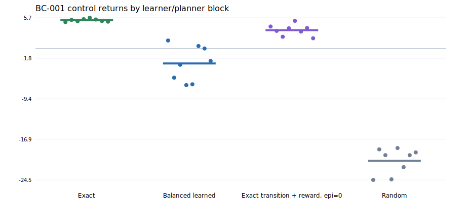
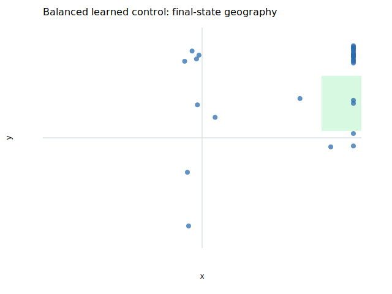
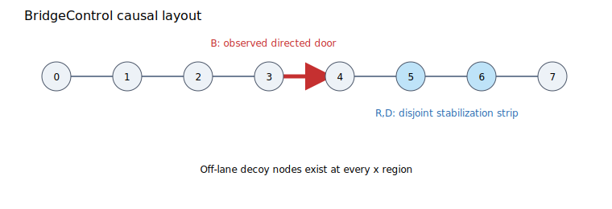

# BC-001 — BridgeControl causal coverage experiment

**Status:** `aborted_invalid_fixture` (non-gated research evidence)

## Outcome

The factorial was stopped before causal contrasts. Exact dynamics with the unchanged
planner achieved 100.0% success, but the designated
balanced learned arm achieved only 6.2% against
the frozen 80% positive-control floor after the one permitted fixture redesign.
Estimating bridge, rank, or density effects would therefore use a BC-001 configuration
that fails its own learned positive control.

This is an informative negative result about the assay, not evidence against every
transition-support hypothesis. It rejects BC-001 as a valid causal test in its current
form and triggers the simulator-oracle/model-error branch. Under the parent portfolio's
predeclared abandonment rule, T1 is retired as the active next mechanism program rather
than rescued with post-hoc changes.

Replacing learned latent transition/uncertainty rollouts with exact raw-state transitions and zero epistemic changed success from 6.2% to 84.4%. This diagnostic rescue shows that the learned reward head is not the sole blocker, but it does not separate transition, representation, and epistemic effects.

## Sequential control decision

| Control | Mean return | Success rate | Criterion | Verdict |
|---|---:|---:|---|---|
| Exact dynamics + exact reward | 5.273 | 1.000 | success ≥ 0.95 | PASS |
| Fully balanced learned B1/Rfull/D8 | -2.770 | 0.062 | success ≥ 0.80 and beats random | FAIL |
| Random policy | -20.901 | 0.000 | named floor | reference |
| Exact transition + learned reward + zero epistemic | 3.439 | 0.844 | localization-only; interpreted under stopped branch | diagnostic |

### Fresh block rows

| Seed | Exact return | Exact success | Balanced return | Balanced success | Exact-transition/learned-reward/zero-epistemic return | Hybrid success |
|---:|---:|---:|---:|---:|---:|---:|
| 0 | 4.940 | 1.000 | 1.510 | 0.000 | 4.116 | 1.000 |
| 1 | 5.344 | 1.000 | -5.415 | 0.000 | 3.301 | 1.000 |
| 2 | 5.096 | 1.000 | -3.012 | 0.000 | 2.209 | 1.000 |
| 3 | 5.477 | 1.000 | -6.793 | 0.000 | 3.784 | 1.000 |
| 4 | 5.748 | 1.000 | -6.646 | 0.500 | 5.173 | 1.000 |
| 5 | 5.421 | 1.000 | 0.477 | 0.000 | 3.172 | 0.500 |
| 6 | 5.135 | 1.000 | 0.019 | 0.000 | 3.828 | 1.000 |
| 7 | 5.023 | 1.000 | -2.301 | 0.000 | 1.926 | 0.250 |

## Manipulation validity

All manipulation checks passed before the control screen:

| Cell | Rows | Nodes | Bridge edges | Local σmin | Unique support/cell |
|---|---:|---:|---:|---:|---:|
| b0_r0_d1 | 896 | 16 | 0 | 0.000 | 1 |
| b0_r0_d8 | 896 | 16 | 0 | 0.000 | 8 |
| b0_r1_d1 | 896 | 16 | 0 | 0.671 | 1 |
| b0_r1_d8 | 896 | 16 | 0 | 0.671 | 8 |
| b1_r0_d1 | 896 | 16 | 16 | 0.000 | 1 |
| b1_r0_d8 | 896 | 16 | 16 | 0.000 | 8 |
| b1_r1_d1 | 896 | 16 | 16 | 0.671 | 1 |
| b1_r1_d8 | 896 | 16 | 16 | 0.671 | 8 |

Every primary cell has identical x-region × door/off-lane counts, nuisance multisets,
and coordinate-wise action histograms. For a fixed bridge setting, bridge-source
state/action/next-state/reward rows are byte-identical across rank and density arms.

## Learned-model localization diagnostics

These are averaged over the eight balanced learned models. Target-latent error is
secondary because each model owns a different learned target encoder.

| Diagnostic | Mean |
|---|---:|
| Reward RMSE | 0.30813 |
| Target-latent MSE / persistence | 0.57001 |
| Prototype raw next-state MSE | 0.01473 |
| Next-region accuracy | 0.68164 |
| Door/off-lane accuracy | 0.99609 |
| Candidate-rank Spearman | 0.87849 |
| Candidate action regret | 0.00000 |
| Mean epistemic | 0.00913 |

The candidate-ranking metrics use one fixed 60-sequence, horizon-five bank at two
diagnostic starts; zero bank regret is not a global planning guarantee.

Final-state geography shows that some controllers ended left of the door, while others
ended at high x outside the y success band. Endpoints alone do not identify the cause.
Because the designated balanced arm contains the bridge, full local action rank, and
eight unique microstates per stabilization cell yet misses its control floor, BC-001
cannot support its intended causal contrasts.

## Not run by design

- seven remaining factorial cells
- action-label permutation control
- nuisance-only control
- second corridor-length replication

No bridge main effect, bridge×rank interaction, bootstrap interval, or novelty
upgrade is reported. The action-permutation and nuisance-only datasets were
prepared and hashed but not trained because the learned positive control failed.

## Reproduction and provenance

- Canonical protocol-record SHA-256: `c9f454674d5510552593594583554ca12ff3abac5ff7b2027102f80d8a824656`
- Protocol-document SHA-256: `1faa31ae04b97540f6fd781e722ea8ea0dacfe59ce0e40e4b7046f8cba49fa40`
- Dataset-manifest file SHA-256: `30b01e4b58a202ed6e1b749636fc7a95c0295ecabfb8dd8b87d9476846590f3c`
- Dataset count: 10
- Git HEAD at execution: `2126fdf2529c475020082b9147e078f3730759ef`; dirty worktree: `true`
- Python: `3.12.9`; NumPy: `2.4.6`
- Development learner/planner seed 97 was excluded; formal blocks are 0–7.
- Full machine-readable rows are in `BC-001-results.json` and `BC-001-runs.csv`.
- `artifact-manifest.json` binds the protocol, manifest, result, CSV, report, and plots.

### Frozen source snapshot

- `bench/bridge_control/__init__.py`: `4f793586ac1b35b617d63b92cdf9d7fb276d3a6b435b3540480bec47c8bdf4d7`
- `bench/bridge_control/__main__.py`: `0689c0518fa6c60ed4a656e6ebe7d6b5f7f19442922a65151c6a953b551810bc`
- `bench/bridge_control/experiment.py`: `9be88d49401c226b1a873cbcb2979d3e0f2ad595d56b0bf146a5f4212b68b224`
- `bench/bridge_control/fixture.py`: `9d288c792ede66e9df750587222c10b5747572ded0a9ebb71d3988ff2f53684b`
- `bench/bridge_control/report.py`: `f529e3585fd099194b7a571189b93005598c6088757e57785c792d99ad4e61ea`
- `docs/research/2026-07-13-bridge-control-protocol.md`: `1faa31ae04b97540f6fd781e722ea8ea0dacfe59ce0e40e4b7046f8cba49fa40`
- `docs/research/2026-07-13-predictive-reliability-portfolio.md`: `7060bafef9fda3e2a42a0f0c19b435aa8e5ccc7d1815df034641632b194b88bd`
- `docs/research/2026-07-13-transformational-research-prompt.md`: `a2b9c6374b4d218347f4fcbf3c4b6afca9ef958231b62dee86d426652d43300a`
- `src/prospect/agent.py`: `3b18a9257491f33e7855293d29b2aaa0af45d6b34392e691293cefc4184214a6`
- `src/prospect/planning.py`: `8e55c57878f40f3652a502ff24f9cc7ee103062ba67f3227de8bbb3a4db11daf`
- `src/prospect/types.py`: `8657cd4a6fa60bb5dae36d43905424c61cdb3cf35e459e152a87a1bbbfa0c6e8`
- `src/prospect/world_model.py`: `6503efd1ca01ae9dd653f80efd19a56dd280ad6d44318c3cdca04e933481e8d6`
- `tests/test_bridge_control.py`: `23e1e914e36f21d2237615253ff7fae4109e4a51a372487fd43d198083903ddf`

Run `python -m bench.bridge_control verify` to recheck current source/protocol binding,
deterministic datasets, raw aggregates, stop-rule semantics, and rendered artifacts.
This fixture is non-gated and changes no shipped claim.
